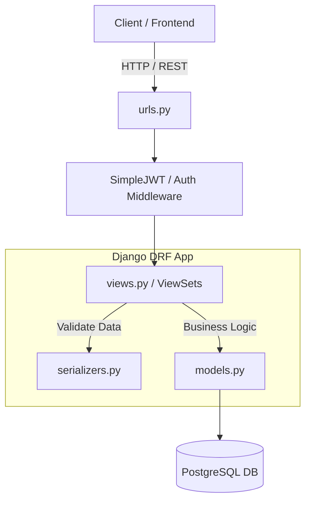

# Architecture Log

## Architecture Overview

XCLONE BACKEND is a Django DRF backend server built to simulate the X(twitter) server

## 1. High-level System Overview

- Models
- Views
- Urls
- Serializers

**OVERVIEW**

## Tech Stack
- Framework: Django 5.x / Django REST Framework
- Database: PostgreSQL
- Auth: JWT (SimpleJWT)
- Pillow
- Token auth
- sendgrid

## Core Decisions
- **Single App Strategy:** Using `api` app for MVP to minimize join overhead.
- **Tweet Hierarchy:** Self-referencing FK on `Tweet` model handles replies and retweets.

## Backend Models
- **Tweets: roburst tweets system with replies, retweets**
- **Notification: notification on tweets, retweets, follow, like, bookmark**
- **Profile: User profile details**
- **Follow/Unfollow:**